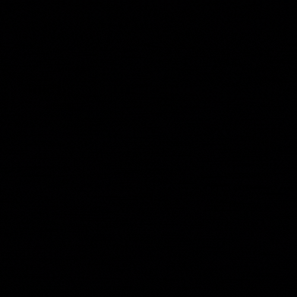

# 💪 Groups

<figure><figcaption>
Tôn trọng - An toàn - Hòa bình
</figcaption></figure>

Nhóm IMS ban đầu có tên là nhóm 908 được lập ra bởi ba thành viên là EnderBeta , Alpha9 , Oneshost (tên viết thế chứ k p sai chính tả) và chủ yếu là để chơi game trên điện thoại với nhau . Nhưng sau nhiều thăng trầm thì nhóm chỉ còn 1 thành viên . Bây giờ 908 được đổi lại thành IMS và lấy trọng tâm là phát triển code và pentesting , kết nạp thành viên từ các mạng xã hội như Facebook , Tweet , các forum hacker khác .....

Chúng tôi đề cao tính cộng đồng và sự vui vẻ ,các thành viên nhóm sẽ có các port riêng để share meme hoặc nói chuyện , chơi game vui vẻ với nhau .

Nhóm gồm một số thành viên chính và quản lý nhóm là : AnonyMe , Khanhsussy , John6we , nguyenchidat (người Việt) - Cmei Bry (Nga) ,John.K (Mỹ) ,David.F(Mỹ) ,Adalbert.F(Đức). Sử dụng tiếng Anh để giao tiếp chung , có thể giao tiếp bằng ngôn ngữ bản thân nếu nói người chung quốc tịch .

Nhóm hiện đang hoạt động ở các server Tor chat bởi sự an toàn và bảo mật , thực ra 30 người chỉ là 30 người Việt ,còn nhóm hiện đang có 246 thành viên từ các nước như Indo ,Mỹ ,Nga ,Đức ,...


các trang web này chỉ là đối với các thành viên Việt Nam , các thành viên nước khác sẽ tự code trang khác để giới thiệu thành viên nước đó.


Link web : https://raw.githack.com/endermeme/anonyme.github.io/main/index.html


HTML sơ sài


Link web : https://anonymeims.w3spaces.com


HTML + CSS nâng cao


